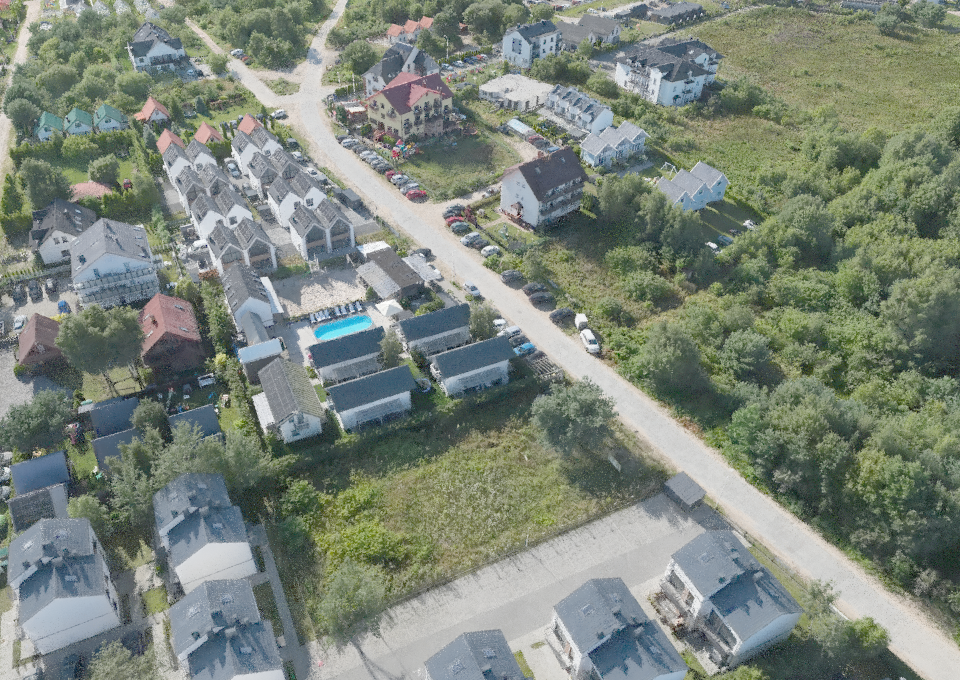
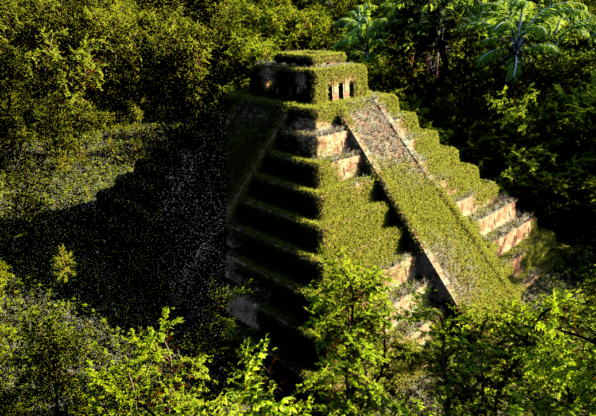
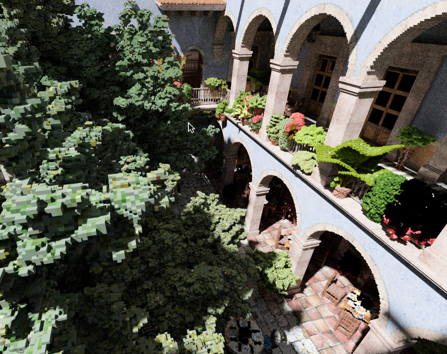
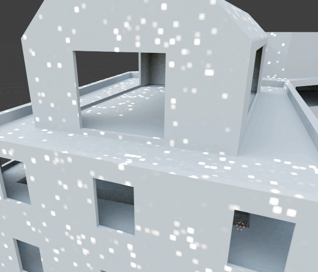

# NBN

NBN is a light Vulkan abstraction library. It's heavily opinionated and is only designed to run on my machines.

- Vulkan 1.3
- Fully bindless, only has a single global descriptor set
- Basic multi-queue support
- Raytracing and mesh shader support
- Dynamic rendering only
- 10-bit sRGB swapchain by default

## Projects

I've used it to write a number of projects:

### Guassian Point Splatting

- Based on [Gaussian Point Splatting](https://jorisar.nl/gaussian_point_splatting/) by Rijsdijk et al.
- Can handle scenes of up to around 300 million splats
- Uses a compressed splat format, see tools/splat-compress.

### Intel Jungle Labs Scene Raytracing

- Heavily instanced ray traced scene with 300 billion triangles total
- Denoising via NRD

### Voxelizer

- GPU mesh voxelizer via rasterization into voxel lists
- Compresses material to 24 color bits, 2 type bits (dielectric/metallic/emissive) and 6 auxillery bits (roughness/log10 emissive strength)
- CPU-side radix sorting and writing into 64-tree via morton encoded locations

### Lightmapper

- Hardware RT lightmapper for glTF scenes
- Environment map importance sampling via an alias table
- Multiple importance sampling to handle both bounces and environment samples
- More info on my blog: https://expenses.github.io/2026/05/07/lightmapper.html

_MIS in action_

### Neural Texture Compression

- Closely based on the paper 'Hardware Accelerated Neural Block Texture Compression with Cooperative Vectors' by Belcour and Benyoub
- Backwards pass via Slang auto differentiation
- Simulated BC1 latent texture sampling in software
- ADAM optimizer for weights, latent textures apply ADAM sparsely using a bitmask to find non-zero gradients
- Uses cooperative matrices via neural.slang

### Meshlet Renderer

- Slightly out of date
- Both Instance and meshlet frustum/cone culling
- Visibility buffer rendering
